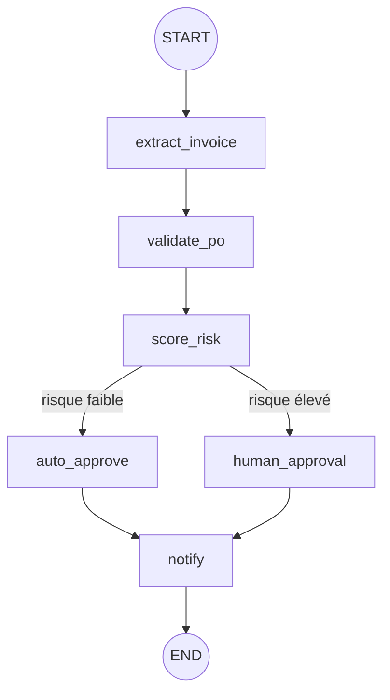

# Alder AP Agent

Un agent qui valide les factures fournisseurs d'une chaîne de restaurants avant paiement, et s'arrête pour demander une validation humaine sur les cas à risque, plutôt que de tout auto-approuver ou de tout bloquer pour une review manuelle intégrale.

## Le problème

**Alder Kitchens**, une chaîne de restaurants, reçoit chaque semaine des factures de ses fournisseurs alimentaires (viande, poisson, légumes, boissons) à comparer à un bon de commande avant paiement. Deux approches naïves échouent :

- **Tout auto-approuver** : un fournisseur non référencé, une facture en double, ou un montant anormal passent sans contrôle.
- **Tout faire relire par un humain** : la plupart des factures sont conformes, et noyer les vrais cas à risque dans un flux de review systématique les rend plus faciles à rater.

Le secteur ajoute une difficulté : un écart de prix sur un produit frais (saisonnalité, cours des matières premières) peut être parfaitement légitime. Le risque n'est pas binaire : un seuil fixe ne suffit pas, il faut un jugement.

## Ce que fait l'agent

Un graphe [LangGraph](https://github.com/langchain-ai/langgraph) à 6 nœuds :

| Nœud | Type | Rôle |
|---|---|---|
| `extract_invoice` | LLM | Extrait les données structurées d'une facture en texte libre (fournisseur, bon de commande, lignes, montant) |
| `validate_po` | déterministe | Compare l'extraction au bon de commande : fournisseur référencé, écarts de quantité/prix, doublon, montant au-dessus du seuil |
| `score_risk` | LLM | Juge la gravité des écarts bruts : un écart de prix seul n'est pas forcément grave, la combinaison de plusieurs signaux l'est davantage |
| `auto_approve` / `human_approval` | routage conditionnel | Risque faible → approbation automatique. Risque élevé → le graphe **s'interrompt** (`interrupt()`) et attend une décision humaine |
| `notify` | déterministe | Enregistre la décision finale |



## Exemple réel

```
→ Facture Primeur Rhône, 45 kg de tomates à 4,80€/kg
  (bon de commande : 30 kg à 3,20€/kg)

← validate_po détecte un écart de quantité (+50%) ET de prix (+50%)
  score_risk : "chaque écart seul pourrait être légitime, mais la
  combinaison des deux est un signal sérieux" → risque élevé
  → le graphe s'interrompt, attend la décision humaine
  → approuvée : "hausse de prix confirmée par le fournisseur (pénurie
  tomates), quantité en plus voulue pour l'événement du week-end"
```

Les cas où l'exécution reprend après interruption retrouvent l'état exact où elle s'était arrêtée (checkpointer LangGraph, indexé par `thread_id`), pas une nouvelle exécution depuis zéro.

## Stack

Python · [LangGraph](https://github.com/langchain-ai/langgraph) (orchestration, state, interrupt/resume) · [langchain-aws](https://github.com/langchain-ai/langchain-aws) (`ChatBedrockConverse`) · Amazon Bedrock (Claude Haiku 4.5) · AWS Bedrock AgentCore (Runtime, Gateway, en cours de déploiement)

## Statut

- **Phase 0** : graphe LangGraph local, routage conditionnel et interruption humaine validés sur 5 cas de test (conforme, fournisseur non référencé, écart quantité/prix, doublon, montant au-dessus du seuil). ✅
- **Phase 1** : déploiement AgentCore, remplacement du checkpointer en mémoire par une persistance durable, puis packaging pour AgentCore Runtime. En cours.
- **Phase 2** : Observability & Evaluations natifs d'AgentCore, plutôt qu'une table de traces et une suite d'évaluation maison.
- **Phase 3** : à définir selon ce qui manque après les trois premières phases.

Suite de [novasupply-agent](https://github.com/UlysseLeb/novasupply-agent), où l'agent décidait seul (pas d'étape de validation humaine) sur une stack AWS différente (Strands, Lambda, CDK).
